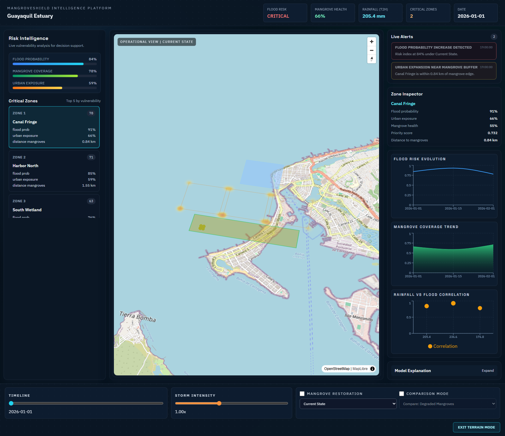
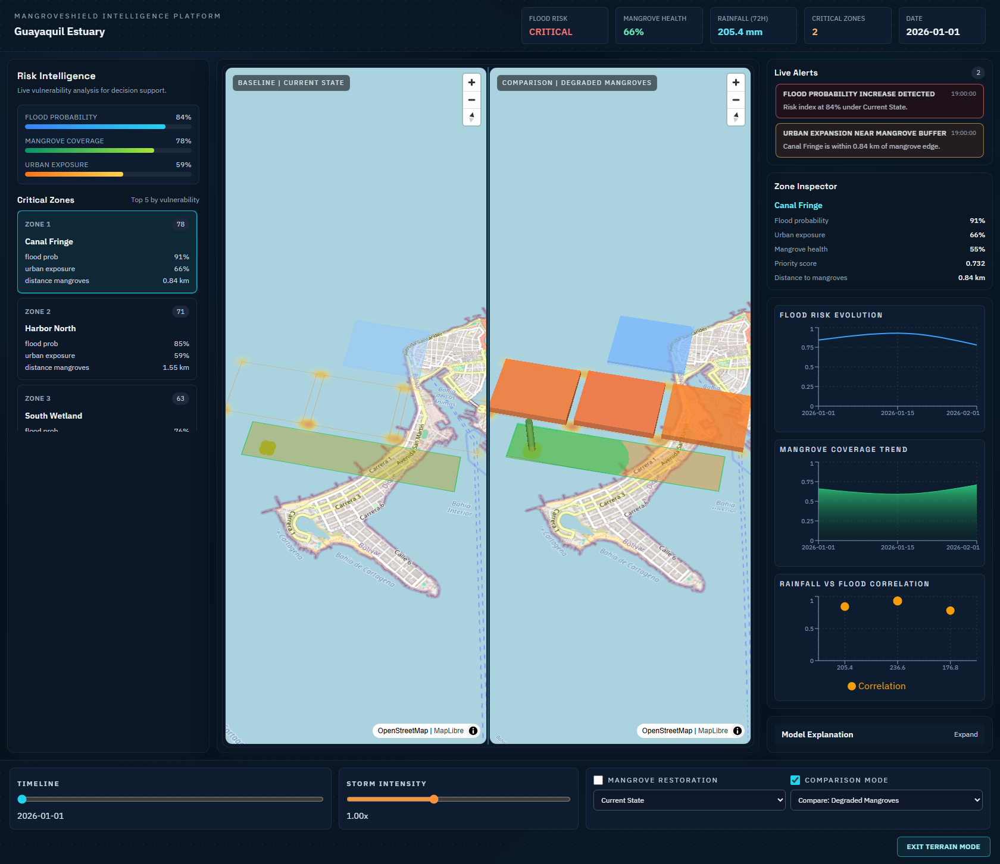

# UX Design - MangroveShield Earth Intelligence

## Design intent

The interface is designed as a climate intelligence command center, not a map-only viewer. Every panel contributes to rapid situational awareness and decision support.
Target operational geography is Greater Guayaquil (Guayas Estuary, Isla Puna, Golfo de Guayaquil, Duran, Samborondon).

## Layout architecture

1. Top Status Bar
- Persistent high-level indicators: region, flood risk level, mangrove health, rainfall (72h), critical zones.
- Animated KPI counters include exposed population and critical infrastructure.
- Indicators update with timeline and scenario controls.

2. Left Analytics Panel
- Risk intelligence summary bars for flood probability, mangrove coverage, urban exposure.
- Critical zone ranking (top 5) with vulnerability context.
- Clickable zone cards trigger map focus and inspection.

3. Central Geospatial Canvas
- MapLibre base map with layered flood, mangrove, urban exposure, and hotspots.
- deck.gl overlays provide flood heat surface, urban pressure points, and hotspot columns.
- Comparison mode provides synchronized split-screen scenario analysis.

4. Bottom Simulation Panel
- Timeline slider.
- Storm intensity slider.
- Mangrove restoration toggle.
- Scenario selector and comparison controls.
- Terrain mode activation for 3D risk extrusion analysis with 2D/3D switch.

5. Right Decision Column
- Live alert stream with animated urgency.
- Zone inspection panel.
- Time-series analytics charts.
- Model explanation panel for transparent interpretation.

## Visual language

- Core shell: deep navy palette for operational readability.
- Flood analytics: blue gradients.
- Mangrove condition: green to red scale.
- Urban pressure: amber/orange highlights.
- Critical alerts: red with animated pulse.

## Motion language (GSAP)

- Top bar loads with fade + slide.
- Left analytics cards reveal with stagger.
- Bottom simulation rail enters from below.
- Scenario changes trigger map crossfade.
- 2D/3D switch applies smooth terrain transition.
- KPI metrics animate with count-up.

## Screenshot references

- Main dashboard: `docs/screenshots/dashboard-main.png`
- Terrain mode: `docs/screenshots/dashboard-terrain.png`
- Comparison mode: `docs/screenshots/dashboard-compare.png`

### Main dashboard

### Terrain mode

### Comparison mode

